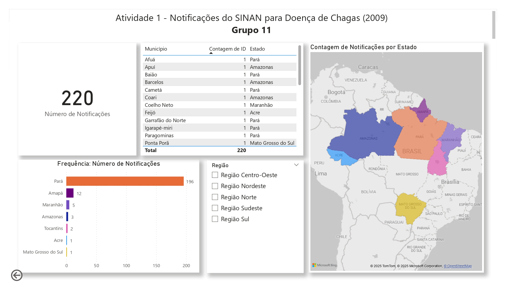

# 📊 Análise das Notificações de Doença de Chagas (2009)

Este projeto foi desenvolvido como parte da Especialização em Ciência de Dados e Saúde Digital – UFPE.
Utilizando o Power BI, explorei dados do SINAN relacionados à Doença de Chagas no ano de 2009, com foco na distribuição de casos por estado, sexo, raça, escolaridade, forma de infecção e resultado de exames.

---

## 🧠 Objetivos
- Visualizar e explorar os dados de notificações de Doença de Chagas
- Identificar padrões por região e perfil dos pacientes
- Aplicar técnicas de visualização de dados em saúde pública

---

## 🛠️ Ferramentas utilizadas
- Power BI
- Dados públicos do SINAN (2009)

---

## 📸 Capturas de Tela

---

## Principais habilidades aplicadas:
- Importação e modelagem de dados em Power BI
- Criação de gráficos interativos e segmentações regionais
- Interpretação de dados clínicos e sociodemográficos
- Comunicação visual de insights epidemiológicos
  
---

## Resumo:
Este painel interativo foi desenvolvido com dados do SINAN (Sistema de Informação de Agravos de Notificação) referentes ao ano de 2009, com foco nas notificações de casos de Doença de Chagas. 
A análise contemplou aspectos demográficos, regionais e clínicos das notificações registradas no Brasil, com destaque para:
- Distribuição geográfica dos casos por estado e município
- Perfil das pessoas notificadas: sexo, raça, escolaridade e gestação
- Modos e locais prováveis de infecção
- Resultados laboratoriais e tipo de confirmação

---

## 📁 Arquivos incluídos
- `powerbi-doenca-de-chagas-Sinan-2009.pbix` – arquivo original do Power BI
- Imagens do dashboard

---

# 📊 Chagas Disease Notification Analysis (2009)

This project was developed during my specialization in Data Science and Digital Health at UFPE – Federal University of Pernambuco (Brazil).
Using Power BI, I explored SINAN (Brazil’s Notifiable Diseases Information System) data related to Chagas Disease in 2009. The goal was to analyze notifications by geographic region, patient demographics, infection types, and exam results.

---

## 🎯 Objectives

- Visualize and explore public health data
- Identify epidemiological patterns and sociodemographic trends
- Apply data visualization techniques using Power BI

---

## 🛠️ Tools Used

- Power BI Desktop
- Public SINAN dataset (2009)

---

## 📸 Screenshots

---

## 🔍 Key Findings

- ~89% of notifications were concentrated in the state of Pará
- Majority of notified individuals self-identified as Pardo (mixed race)
- Over 95% of cases were confirmed via laboratory exams

---

## 📁 Files

- `powerbi-doenca-de-chagas-Sinan-2009.pbix`: Power BI project file
- `dashboard_1.png` and `dashboard_2.png`: Dashboard screenshots
